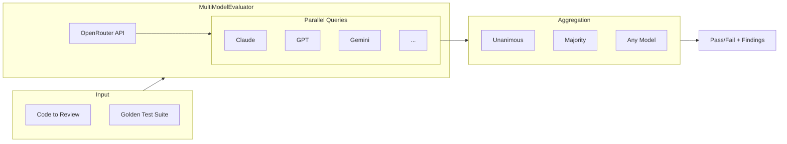

# Open Reviewer

**Multi-model consensus for AI code review verification**

Open Reviewer is a testing framework for verifying AI code review quality. It enables you to test whether AI models correctly identify anti-patterns, security issues, and code quality problems—and provides confidence through multi-model consensus.

The core innovation is **multi-model consensus**: rather than trusting a single model's opinion, Open Reviewer queries multiple state-of-the-art LLMs simultaneously and aggregates their findings into unanimous, majority, and any-model consensus levels.

Designed to work alongside Claude Code and other AI code reviewers, Open Reviewer helps you deploy AI-powered code review with measurable quality guarantees.

## Features

- **Multi-Model Consensus** - Query multiple LLMs and aggregate findings (unanimous, majority, any)
- **Golden Test Suite** - 15+ pre-built test cases covering common anti-patterns
- **Language Support** - Python, TypeScript, SQL, and security-focused tests
- **Semantic Evaluation** - Embedding-based similarity, AST parsing, repository maps
- **GitHub Actions Integration** - Automated PR reviews with multi-stage processing
- **13 Models Across 4 Tiers** - From frontier models to fast alternatives

## Architecture



## Quick Start

```bash
git clone https://github.com/georgepearse/open-reviewer.git
cd open-reviewer/review_eval
uv sync

export OPENROUTER_API_KEY="your-key-here"
uv run pytest -v
```

## Usage

```python
from review_eval import MultiModelEvaluator, GoldenTestCase

evaluator = MultiModelEvaluator(
    prompt_context="Review this code for security issues and best practices."
)

test_case = GoldenTestCase(
    id="sql-injection-test",
    file_path="example.py",
    code="query = f'SELECT * FROM users WHERE id = {user_id}'",
    expected_issues=["SQL injection", "parameterized"],
    category="security",
)

result = evaluator.evaluate(test_case)

# Consensus results
print(f"Unanimous (all models): {result.unanimous_findings}")
print(f"Consensus (majority):   {result.consensus_findings}")
print(f"Any model found:        {result.any_model_findings}")
```

## Model Tiers

Open Reviewer supports 13 models across 4 tiers via OpenRouter:

| Tier | Models |
|------|--------|
| **Frontier** | Claude Opus 4.5, GPT-5.1 Codex, Gemini 3 Pro |
| **Production** | Claude 3.5 Sonnet, GPT-4o, Gemini 2.5 Pro |
| **Fast** | Claude 3.5 Haiku, GPT-4o Mini, Gemini 2.0 Flash |
| **Alternative** | DeepSeek V3, Llama 3.3 70B, Qwen 2.5 72B, Mistral Large |

```python
from review_eval import MultiModelEvaluator, BENCHMARK_MODELS

# Use all 13 models for comprehensive benchmarking
evaluator = MultiModelEvaluator(prompt, models=BENCHMARK_MODELS)
```

## Test Categories

### Python
- `psycopg2` instead of `psycopg3`
- `yaml.load()` instead of `yaml.safe_load()`
- Missing type annotations
- Untyped `Any` abuse
- Generic `utils` modules

### TypeScript
- Raw `fetch()` instead of typed helpers
- `any` types
- Default exports (prefer named)
- Direct database queries

### SQL
- Boolean columns without `is_` prefix
- `VARCHAR(n)` instead of `TEXT`
- `SELECT *` instead of explicit columns
- `TIMESTAMP` without time zone

### Security
- SQL injection via string formatting
- Hardcoded secrets and API keys
- Command injection (`shell=True`)

## GitHub Actions

Open Reviewer includes a GitHub Actions workflow for automated PR reviews:

```yaml
# .github/workflows/review.yml
# - Parses AGENTS.md files for review guidelines
# - Reviews changed code chunks in parallel
# - Runs dedicated security analysis
# - Posts inline comments on PRs
```

See the [GitHub Actions Integration tutorial](https://georgepearse.github.io/open-reviewer/tutorials/github-actions-integration/) for configuration details.

## Adding Custom Tests

```python
test_case = GoldenTestCase(
    id="my-custom-antipattern",
    file_path="fixtures/python/my_antipattern.py",
    code=code,
    expected_issues=["keyword1", "keyword2"],
    category="python",
)

result = evaluator.evaluate(test_case)
assert result.passed
```

## Documentation

Full documentation is available at [georgepearse.github.io/open-reviewer](https://georgepearse.github.io/open-reviewer/):

- [Tutorials](https://georgepearse.github.io/open-reviewer/tutorials/) - Step-by-step learning guides
- [How-To Guides](https://georgepearse.github.io/open-reviewer/how-to/) - Task-oriented guides
- [Reference](https://georgepearse.github.io/open-reviewer/reference/) - API and CLI documentation
- [Explanation](https://georgepearse.github.io/open-reviewer/explanation/) - Architecture and concepts

## Requirements

- Python 3.12+
- API Keys:
  - `ANTHROPIC_API_KEY` - For single-model evaluation (Claude)
  - `OPENROUTER_API_KEY` - For multi-model consensus

## Contributing

Contributions are welcome. See [Contributing](https://georgepearse.github.io/open-reviewer/contributing/) for guidelines.
