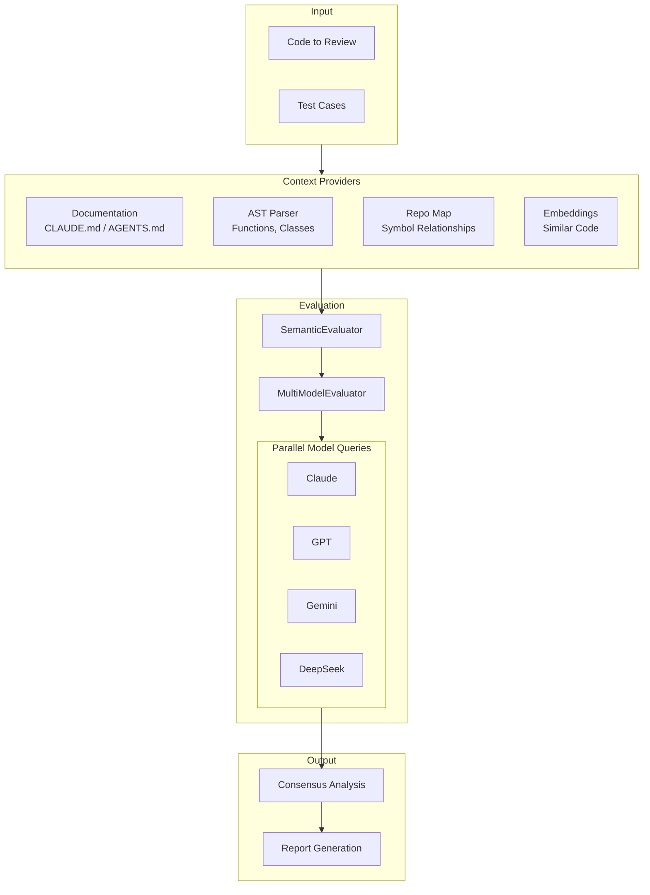
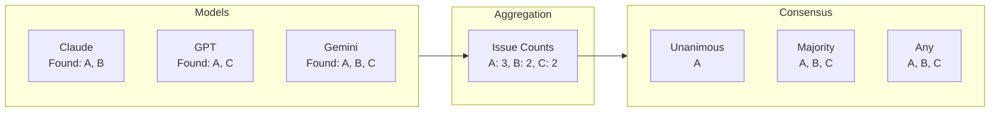
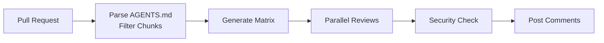
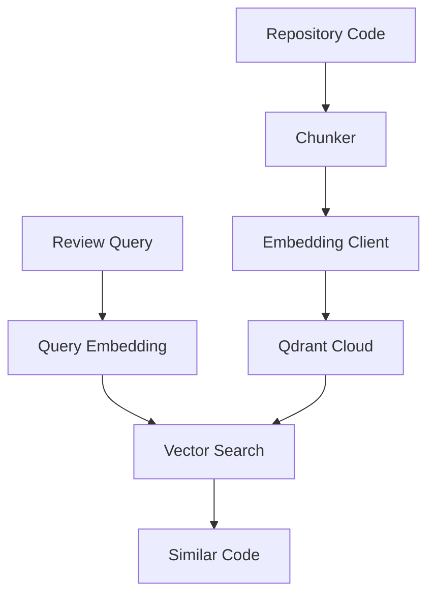

# Architecture

Open Reviewer is designed as a layered system that combines multiple AI models with rich code context.

## System Overview



## Core Components

### Evaluators

The evaluation layer is built on inheritance:

1. **ReviewEvaluator** - Base evaluator using Anthropic API directly
2. **MultiModelEvaluator** - Parallel querying of multiple models via OpenRouter
3. **DocsAwareEvaluator** - Adds documentation context
4. **SemanticEvaluator** - Adds AST, repo map, and embedding context

### Context Providers

Four types of context enhance review quality:

| Provider | Source | Purpose |
|----------|--------|---------|
| Documentation | CLAUDE.md, AGENTS.md | Project-specific guidelines |
| AST Context | Python AST parser | Function signatures, class structure |
| Repository Map | Code analysis | Key symbols and relationships |
| Similar Code | Vector embeddings | Related code patterns |

### Consensus Engine

The consensus engine aggregates findings from multiple models:



## Data Flow

### 1. Input Processing

```python
test_case = GoldenTestCase(
    id="example",
    code="...",
    expected_issues=["keyword1", "keyword2"],
)
```

### 2. Context Gathering

The SemanticEvaluator gathers context from multiple sources:

```python
# Documentation context (15K tokens)
docs = discover_docs(repo_root)
relevant_docs = select_docs_for_path(docs, file_path)

# AST context (3K tokens)
ast_context = ast_parser.parse(code, "python")

# Repository map (2K tokens)
repo_map = map_generator.generate(focus_file=file_path)

# Similar code (8K tokens)
similar = await semantic_search.find_similar(code)
```

### 3. Prompt Construction

Context is combined into a single prompt with token budgets:

```
[System: Review Instructions]
[Documentation: CLAUDE.md, AGENTS.md content]
[AST: Function signatures, class definitions]
[Repo Map: Key symbols in codebase]
[Similar Code: Related implementations]
[User: Code to review]
```

### 4. Parallel Model Queries

```python
tasks = [
    evaluate_model(claude, prompt),
    evaluate_model(gpt, prompt),
    evaluate_model(gemini, prompt),
]
results = await asyncio.gather(*tasks)
```

### 5. Consensus Calculation

```python
# Count issue occurrences
issue_counts = Counter(all_matched_issues)
total_models = len(models)
majority_threshold = total_models // 2 + 1

# Determine consensus levels
unanimous = [i for i, c in counts.items() if c == total_models]
majority = [i for i, c in counts.items() if c >= majority_threshold]
any_model = list(counts.keys())
```

## Integration Points

### GitHub Actions



### Qdrant Vector Store



## Extension Points

### Custom Models

Add new models by creating ModelConfig:

```python
custom_model = ModelConfig(
    name="My Model",
    model_id="provider/model-id",
    weight=1.0,
)
```

### Custom Context Providers

Extend SemanticEvaluator to add new context sources by overriding `_build_prompt()`.

### Custom Consensus Logic

Subclass MultiModelEvaluator to implement weighted voting or other consensus algorithms.
