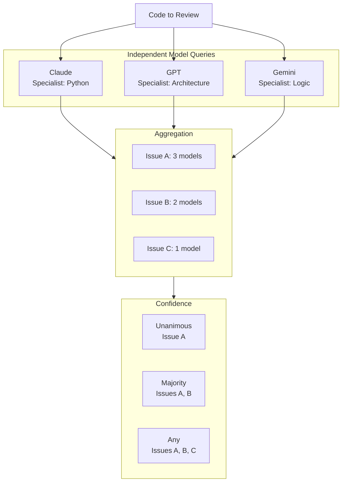

# Multi-Model Consensus

Understanding why and how Open Reviewer uses multiple AI models.

## The Problem with Single-Model Reviews

Single-model code reviews have limitations:

1. **Model-specific biases** - Each model has training data biases
2. **Inconsistent findings** - Same model may produce different results
3. **Blind spots** - No single model catches everything
4. **Overconfidence** - Hard to know when to trust the model

## The Consensus Solution

By querying multiple models and aggregating their findings, we get:

- **Higher confidence** when models agree
- **Better coverage** from diverse perspectives
- **Reduced bias** through averaging
- **Measurable reliability** through consensus levels



## Consensus Levels

### Unanimous

All models found the issue.

```python
unanimous_issues = [
    issue for issue, count in issue_counts.items()
    if count == total_models
]
```

**Use case:** High-confidence findings for automated actions (blocking PRs, requiring fixes).

### Majority

More than half of models found the issue.

```python
majority_threshold = total_models // 2 + 1
consensus_issues = [
    issue for issue, count in issue_counts.items()
    if count >= majority_threshold
]
```

**Use case:** Standard confidence for review comments.

### Any Model

At least one model found the issue.

```python
any_model_issues = list(issue_counts.keys())
```

**Use case:** Maximum sensitivity for security reviews or educational purposes.

## Practical Examples

### Example 1: SQL Injection

```python
code = "query = f'SELECT * FROM users WHERE id = {user_id}'"
expected_issues = ["SQL injection", "parameterized"]
```

Results from 3 models:

| Model | Found Issues |
|-------|-------------|
| Claude | SQL injection, parameterized, f-string |
| GPT | SQL injection, parameterized query |
| Gemini | SQL injection, prepared statement |

Consensus:
- **Unanimous:** SQL injection
- **Majority:** SQL injection, parameterized (2/3 models)
- **Any:** SQL injection, parameterized, f-string, prepared statement

### Example 2: Missing Types

```python
code = "def process(data): return data.strip()"
expected_issues = ["type annotation"]
```

| Model | Found Issues |
|-------|-------------|
| Claude | type annotation, type hint |
| GPT | typing, annotation |
| Gemini | (none) |

Consensus:
- **Unanimous:** (none)
- **Majority:** type annotation (2/3)
- **Any:** type annotation, type hint, typing

## Choosing Consensus Level

### For Blocking PRs

Use **unanimous** or strict **majority**:

```python
if result.unanimous_issues or len(result.consensus_issues) >= 2:
    block_pr()
```

### For Review Comments

Use **majority** consensus:

```python
for issue in result.consensus_issues:
    post_review_comment(issue)
```

### For Security Audits

Use **any model** for maximum coverage:

```python
for issue in result.any_model_issues:
    log_potential_vulnerability(issue)
```

## Model Diversity

### Why Diversity Matters

Different models have different strengths:

| Model | Strength |
|-------|----------|
| Claude | Nuanced reasoning, following guidelines |
| GPT | Broad knowledge, code patterns |
| Gemini | Logic, mathematical reasoning |
| DeepSeek | Code-specific training |

### Configuring for Diversity

```python
diverse_models = [
    # Different providers
    ModelConfig(name="Claude", model_id="anthropic/claude-3.5-sonnet"),
    ModelConfig(name="GPT", model_id="openai/gpt-4o"),
    ModelConfig(name="Gemini", model_id="google/gemini-2.5-pro-preview-05-06"),
    ModelConfig(name="DeepSeek", model_id="deepseek/deepseek-chat"),

    # Different sizes (same provider)
    ModelConfig(name="Claude Opus", model_id="anthropic/claude-opus-4.5"),
    ModelConfig(name="Claude Haiku", model_id="anthropic/claude-3.5-haiku"),
]
```

## Cost Optimization

### Trade-offs

| Configuration | Cost | Coverage | Speed |
|---------------|------|----------|-------|
| 3 frontier models | $$$ | Best | Slowest |
| 3 production models | $$ | Good | Fast |
| 3 fast models | $ | Moderate | Fastest |
| 13 all models | $$$$ | Maximum | Varies |

### Recommended Configurations

**Daily PR reviews:**
```python
models = DEFAULT_MODELS  # 3 frontier models
```

**Security audits:**
```python
models = BENCHMARK_MODELS  # All 13 models
```

**Development/testing:**
```python
models = [
    ModelConfig(name="GPT-4o Mini", model_id="openai/gpt-4o-mini"),
    ModelConfig(name="Claude Haiku", model_id="anthropic/claude-3.5-haiku"),
]
```

## Limitations

1. **Not a guarantee** - Consensus doesn't mean correctness
2. **Cost scales linearly** - More models = more API calls
3. **Latency is max of models** - Parallel but bounded by slowest
4. **Keyword matching** - Current implementation uses simple keyword matching

## Future Improvements

- Weighted voting based on model confidence
- Semantic similarity for issue matching
- Historical accuracy tracking per model
- Dynamic model selection based on code type
