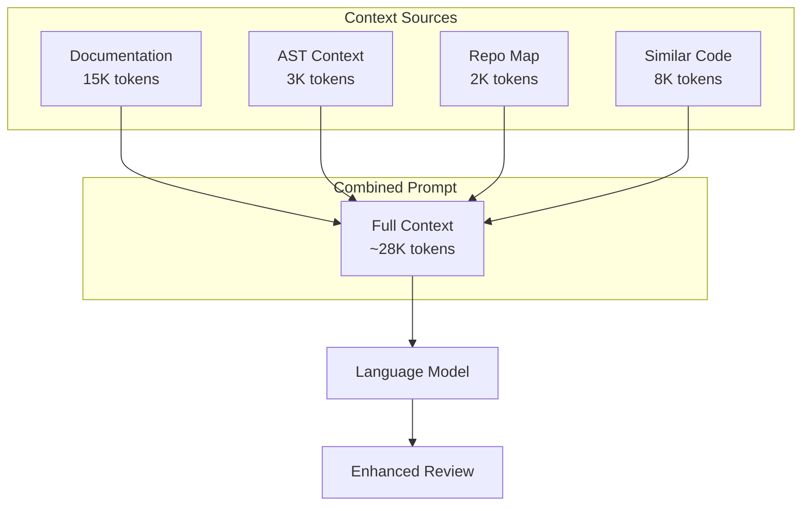
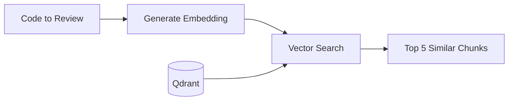

# Semantic Context

How Open Reviewer uses code understanding to improve reviews.

## The Context Problem

LLMs reviewing code face a fundamental challenge: they only see the code snippet, not the surrounding context. This leads to:

- Missing project conventions
- Ignorance of related code
- Inability to understand architectural patterns
- Generic advice that doesn't fit the codebase

## Four Types of Context

Open Reviewer solves this with four complementary context sources:



## 1. Documentation Context

### Sources

- **CLAUDE.md** - Repository-wide guidelines
- **AGENTS.md** - Domain-specific instructions (per directory)

### How It Works

```python
# Discovery
docs = discover_docs(repo_root)
# Returns: [CLAUDE.md, backend/AGENTS.md, frontend/AGENTS.md, ...]

# Selection based on file path
relevant = select_docs_for_path(docs, "backend/auth/login.py")
# Returns: [CLAUDE.md, backend/AGENTS.md]

# Build prompt with token budget
prompt = build_docs_prompt(relevant, max_tokens=15000)
```

### Example CLAUDE.md

```markdown
# Repository Guidelines

## Code Style
- Use type hints on all public functions
- Prefer composition over inheritance
- Maximum function length: 50 lines

## Security
- Never log sensitive data
- Use parameterized queries
- Validate all user input
```

### Example AGENTS.md

```markdown
# Backend Guidelines

## Database Access
- Use the repository pattern
- No direct SQL in handlers
- Use transactions for multi-step operations

## Authentication
- All endpoints require auth by default
- Use @public decorator for exceptions
```

## 2. AST Context

### What It Captures

- Function signatures and docstrings
- Class definitions and methods
- Import statements
- Variable type annotations

### How It Works

```python
parser = ASTParser()
context = parser.parse(code, "python", "auth/login.py")

# Returns:
ASTContext(
    functions=[
        FunctionSignature(
            name="authenticate",
            args=["username: str", "password: str"],
            return_type="User | None",
            docstring="Authenticate a user.",
        )
    ],
    classes=[...],
    imports=[ImportInfo(module="bcrypt", names=["hashpw"])],
)
```

### Why It Matters

AST context helps the model understand:

- Expected types and contracts
- Available utilities and helpers
- Module structure and dependencies

## 3. Repository Map

### What It Is

An Aider-style map showing key symbols in the codebase.

### Example Output

```
src/
  auth/
    login.py
      def authenticate(username, password) -> User
      def verify_token(token) -> Claims
    session.py
      class SessionManager
        def create(user) -> Session
        def invalidate(session_id) -> None
  models/
    user.py
      class User(BaseModel)
        id: UUID
        email: str
        password_hash: str
```

### How It's Generated

```python
generator = RepoMapGenerator(repo_root)
repo_map = generator.generate(
    focus_file="auth/login.py",  # Prioritize related symbols
    max_tokens=2000,
    max_depth=3,
)
```

### Symbol Ranking

Symbols are ranked by relevance to the focus file:

1. Symbols in the same file
2. Symbols imported by the file
3. Symbols in the same directory
4. Frequently referenced symbols

## 4. Similar Code (Embeddings)

### What It Is

Code snippets from the repository that are semantically similar to the code being reviewed.

### How It Works



```python
search = SemanticSearch(repo_root, qdrant_url, qdrant_api_key)

# Find similar code
results = await search.find_similar(
    query=code_to_review,
    limit=5,
    min_similarity=0.5,
)

for result in results:
    print(f"{result.file_path}: {result.similarity:.2f}")
    print(result.content)
```

### Why It Matters

Similar code shows:

- How similar problems were solved elsewhere
- Existing patterns to follow (or avoid)
- Related functionality that might be affected

### Example

Reviewing authentication code might surface:

```python
# Found in: auth/oauth.py (similarity: 0.85)
def authenticate_oauth(provider: str, token: str) -> User:
    """Authenticate via OAuth provider."""
    claims = verify_oauth_token(provider, token)
    return get_or_create_user(claims.email)
```

This helps the model understand the project's authentication patterns.

## Token Budget Allocation

The SemanticEvaluator allocates tokens across context types:

| Source | Default | Purpose |
|--------|---------|---------|
| Documentation | 15,000 | Project rules and guidelines |
| Similar Code | 8,000 | Related implementations |
| AST Context | 3,000 | Code structure |
| Repo Map | 2,000 | Key symbols |
| Instructions | 2,000 | Review guidelines |
| **Total** | **~30,000** | Full context window |

### Customizing Budgets

```python
evaluator = create_semantic_evaluator(
    repo_root="/path/to/repo",
    file_path="src/api/handlers.py",
    code=code,
    doc_budget=20000,      # More docs
    similar_code_budget=5000,  # Less similar code
    ast_budget=3000,
    repo_map_budget=2000,
)
```

## When to Use Each Context Type

| Context | Best For |
|---------|----------|
| Documentation | Style/convention violations, security rules |
| AST | Type errors, API misuse, signature mismatches |
| Repo Map | Architectural issues, missing abstractions |
| Similar Code | Pattern inconsistencies, duplication |

## Limitations

1. **Token limits** - Can't include entire codebase
2. **Indexing required** - Embeddings need initial setup
3. **Python-focused** - AST parsing best for Python
4. **Stale context** - Requires re-indexing after changes
