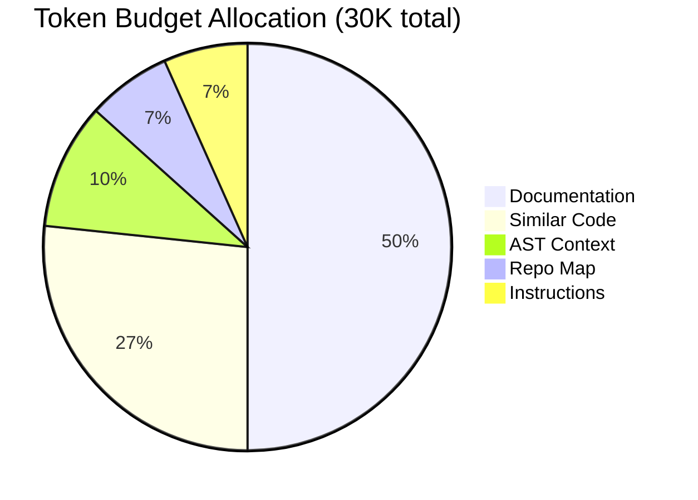

# Token Budgets

How Open Reviewer manages context within LLM token limits.

## The Token Constraint

LLMs have context window limits:

| Model | Context Window |
|-------|---------------|
| Claude 3.5 Sonnet | 200K tokens |
| GPT-4o | 128K tokens |
| Gemini 2.5 Pro | 1M tokens |

While these are large, including too much context can:

- Increase costs (pricing is per-token)
- Slow down responses
- Dilute important information with noise

## Default Budget Allocation

The SemanticEvaluator uses these defaults:



| Source | Tokens | Percentage |
|--------|--------|------------|
| Documentation | 15,000 | 50% |
| Similar Code | 8,000 | 27% |
| AST Context | 3,000 | 10% |
| Repository Map | 2,000 | 7% |
| Instructions | 2,000 | 7% |
| **Total** | **30,000** | 100% |

## Why These Defaults?

### Documentation (50%)

The largest allocation because:

- Project guidelines are most relevant to reviews
- CLAUDE.md/AGENTS.md contain specific rules
- Violations of guidelines are high-value findings

### Similar Code (27%)

Second largest because:

- Shows existing patterns to follow
- Helps identify inconsistencies
- Provides concrete examples

### AST Context (10%)

Moderate allocation:

- Structure information is compact
- Function signatures don't need much space
- Provides essential type context

### Repository Map (7%)

Smaller allocation:

- Overview doesn't need details
- Key symbols are summarized
- Helps with navigation, not deep analysis

### Instructions (7%)

Small but important:

- Review guidelines are concise
- Defines what to look for
- Sets the task framing

## Customizing Budgets

### For Documentation-Heavy Reviews

When project guidelines are critical:

```python
evaluator = create_semantic_evaluator(
    repo_root=repo,
    file_path=file,
    code=code,
    doc_budget=25000,        # Increased
    similar_code_budget=3000, # Decreased
    ast_budget=2000,
)
```

### For Pattern Matching

When finding inconsistencies matters most:

```python
evaluator = create_semantic_evaluator(
    repo_root=repo,
    file_path=file,
    code=code,
    doc_budget=8000,
    similar_code_budget=15000,  # Increased
    ast_budget=5000,            # Increased
)
```

### For Type-Heavy Codebases

When type correctness is paramount:

```python
evaluator = create_semantic_evaluator(
    repo_root=repo,
    file_path=file,
    code=code,
    ast_budget=8000,           # Increased
    similar_code_budget=5000,
    doc_budget=12000,
)
```

## Token Counting

Tokens are estimated, not exact:

```python
def estimate_tokens(text: str) -> int:
    """Rough estimate: ~4 characters per token."""
    return len(text) // 4
```

For more accurate counting, use tiktoken:

```python
import tiktoken

encoder = tiktoken.get_encoding("cl100k_base")
tokens = len(encoder.encode(text))
```

## Truncation Strategies

When content exceeds budgets, it's truncated:

### Documentation

- Prioritizes CLAUDE.md over AGENTS.md
- Keeps most relevant sections based on file path
- Truncates from the end

### Similar Code

- Keeps highest similarity matches
- Truncates lower similarity results first

### AST Context

- Prioritizes functions over classes
- Keeps signatures, may drop docstrings

### Repository Map

- Reduces depth first
- Keeps focus file's directory

## Cost Implications

More tokens = higher costs:

| Budget | Est. Cost per Review |
|--------|---------------------|
| 10K tokens | ~$0.01 |
| 30K tokens | ~$0.03 |
| 50K tokens | ~$0.05 |
| 100K tokens | ~$0.10 |

*Costs vary by model and provider*

### Cost Optimization Tips

1. **Use smaller budgets for CI** - Fast feedback matters more
2. **Use larger budgets for security** - Thoroughness matters more
3. **Use fast models with larger context** - Claude Haiku + more tokens
4. **Cache context** - Reuse documentation context across reviews

## Monitoring Budget Usage

```python
evaluator = create_semantic_evaluator(...)
result = evaluator.evaluate(test_case)

# Check actual usage (if implemented)
print(f"Docs tokens: {evaluator.docs_tokens_used}")
print(f"Similar code tokens: {evaluator.similar_tokens_used}")
```

## Best Practices

### 1. Start with Defaults

The defaults work well for most cases.

### 2. Measure, Then Optimize

Track which context sources lead to better reviews.

### 3. Consider the Review Type

| Review Type | Focus Budget On |
|-------------|-----------------|
| Style review | Documentation |
| Security audit | Similar code, Documentation |
| Type checking | AST context |
| Architecture | Repo map |

### 4. Test Budget Changes

Run the same test cases with different budgets to measure impact.
