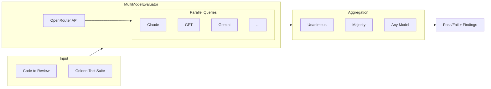

# Open Reviewer

**Multi-model consensus for AI code review verification**

Open Reviewer is a testing framework for verifying AI code review quality. It enables you to test whether AI models correctly identify anti-patterns, security issues, and code quality problems—and provides confidence through multi-model consensus.

## The Core Innovation

Rather than trusting a single model's opinion, Open Reviewer queries multiple state-of-the-art LLMs simultaneously and aggregates their findings into three consensus levels:

- **Unanimous** - All models agree on the issue
- **Majority** - More than half of models found it
- **Any** - At least one model detected it



## Features

- :material-check-all: **Multi-Model Consensus** - Query multiple LLMs and aggregate findings
- :material-gate: **PR Quality Gate** - Automated quality scoring (0-100) with multi-metric analysis
- :material-test-tube: **Golden Test Suite** - 15+ pre-built test cases covering common anti-patterns
- :material-language-python: **Language Support** - Python, TypeScript, SQL, and security-focused tests
- :material-magnify: **Semantic Evaluation** - Embedding-based similarity, AST parsing, repository maps
- :material-github: **GitHub Actions Integration** - Automated PR reviews with multi-stage processing
- :material-brain: **13 Models Across 4 Tiers** - From frontier models to fast alternatives

## Quick Start

```bash
git clone https://github.com/georgepearse/open-reviewer.git
cd open-reviewer/review_eval
uv sync

export OPENROUTER_API_KEY="your-key-here"
uv run pytest -v
```

## Basic Usage

```python
from review_eval import MultiModelEvaluator, GoldenTestCase

evaluator = MultiModelEvaluator(
    prompt_context="Review this code for security issues and best practices."
)

test_case = GoldenTestCase(
    id="sql-injection-test",
    file_path="example.py",
    code="query = f'SELECT * FROM users WHERE id = {user_id}'",
    expected_issues=["SQL injection", "parameterized"],
    category="security",
)

result = evaluator.evaluate(test_case)

# Consensus results
print(f"Unanimous (all models): {result.unanimous_issues}")
print(f"Consensus (majority):   {result.consensus_issues}")
print(f"Any model found:        {result.any_model_issues}")
```

## Requirements

- Python 3.12+
- API Keys:
    - `ANTHROPIC_API_KEY` - For single-model evaluation (Claude)
    - `OPENROUTER_API_KEY` - For multi-model consensus

## Next Steps

<div class="grid cards" markdown>

-   :material-school:{ .lg .middle } **Tutorials**

    ---

    Learn how to use Open Reviewer step-by-step

    [:octicons-arrow-right-24: Get started](tutorials/index.md)

-   :material-account:{ .lg .middle } **User Guides**

    ---

    Comprehensive guides for using Open Reviewer features

    [:octicons-arrow-right-24: User guides](guide/index.md)

-   :material-book-open-variant:{ .lg .middle } **How-To Guides**

    ---

    Practical guides for specific tasks

    [:octicons-arrow-right-24: How-to guides](how-to/index.md)

-   :material-file-document:{ .lg .middle } **Reference**

    ---

    API documentation and specifications

    [:octicons-arrow-right-24: Reference](reference/index.md)

-   :material-lightbulb:{ .lg .middle } **Explanation**

    ---

    Understand the architecture and concepts

    [:octicons-arrow-right-24: Learn more](explanation/index.md)

</div>
