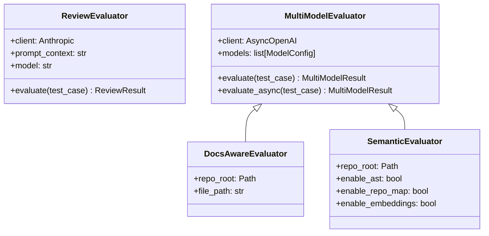

# Evaluators

Open Reviewer provides four evaluator classes, each building on the previous:



## ReviewEvaluator

Single-model evaluation using the Anthropic API directly.

```python
from review_eval import ReviewEvaluator, GoldenTestCase

evaluator = ReviewEvaluator(
    prompt_context="Review this code for issues.",
    model="claude-sonnet-4-20250514"
)

test_case = GoldenTestCase(
    id="example",
    file_path="example.py",
    code="import yaml; yaml.load(data)",
    expected_issues=["safe_load"],
    category="security",
)

result = evaluator.evaluate(test_case)
print(f"Passed: {result.passed}")
print(f"Matched: {result.matched_issues}")
print(f"Missed: {result.missed_issues}")
```

### Constructor

```python
ReviewEvaluator(
    prompt_context: str,
    model: str = "claude-sonnet-4-20250514"
)
```

| Parameter | Type | Description |
|-----------|------|-------------|
| `prompt_context` | `str` | System prompt with review instructions |
| `model` | `str` | Anthropic model ID (default: claude-sonnet-4-20250514) |

### Methods

#### evaluate

```python
def evaluate(self, test_case: GoldenTestCase) -> ReviewResult
```

Evaluate a test case and return the result.

---

## MultiModelEvaluator

Multi-model evaluation using OpenRouter for consensus-based reviews.

```python
from review_eval import MultiModelEvaluator, GoldenTestCase, DEFAULT_MODELS

evaluator = MultiModelEvaluator(
    prompt_context="Review this code for security issues.",
    models=DEFAULT_MODELS,  # Claude, GPT, Gemini
)

result = evaluator.evaluate(test_case)

print(f"Pass Rate: {result.pass_rate:.0%}")
print(f"Unanimous: {result.unanimous_issues}")
print(f"Consensus: {result.consensus_issues}")
print(f"Any Model: {result.any_model_issues}")
```

### Constructor

```python
MultiModelEvaluator(
    prompt_context: str,
    models: list[ModelConfig] | None = None,
    api_key: str | None = None,
)
```

| Parameter | Type | Description |
|-----------|------|-------------|
| `prompt_context` | `str` | System prompt with review instructions |
| `models` | `list[ModelConfig]` | Models to query (default: DEFAULT_MODELS) |
| `api_key` | `str` | OpenRouter API key (default: OPENROUTER_API_KEY env) |

### Methods

#### evaluate

```python
def evaluate(self, test_case: GoldenTestCase) -> MultiModelResult
```

Synchronous evaluation. Calls `evaluate_async` internally.

#### evaluate_async

```python
async def evaluate_async(self, test_case: GoldenTestCase) -> MultiModelResult
```

Evaluate a test case with all models in parallel.

### Attributes

| Attribute | Type | Description |
|-----------|------|-------------|
| `client` | `AsyncOpenAI` | OpenRouter-compatible client |
| `models` | `list[ModelConfig]` | Configured models |
| `prompt_context` | `str` | System prompt |

---

## DocsAwareEvaluator

Extends MultiModelEvaluator with documentation context from CLAUDE.md and AGENTS.md files.

```python
from review_eval import DocsAwareEvaluator

evaluator = DocsAwareEvaluator(
    repo_root="/path/to/repo",
    file_path="src/auth/login.py",
    models=DEFAULT_MODELS,
    extra_instructions="Focus on authentication security.",
    max_doc_tokens=15000,
)
```

### Constructor

```python
DocsAwareEvaluator(
    repo_root: str | Path,
    file_path: str,
    models: list[ModelConfig] | None = None,
    extra_instructions: str = "",
    api_key: str | None = None,
    max_doc_tokens: int = 15000,
)
```

| Parameter | Type | Description |
|-----------|------|-------------|
| `repo_root` | `Path` | Repository root directory |
| `file_path` | `str` | Path to the file being reviewed |
| `models` | `list[ModelConfig]` | Models to query |
| `extra_instructions` | `str` | Additional review instructions |
| `api_key` | `str` | OpenRouter API key |
| `max_doc_tokens` | `int` | Max tokens for documentation context |

---

## SemanticEvaluator

Full-featured evaluator with AST context, repository maps, and embedding-based similar code search.

```python
from review_eval import create_semantic_evaluator

evaluator = create_semantic_evaluator(
    repo_root="/path/to/repo",
    file_path="src/api/handlers.py",
    code="def handle_request(req): ...",
    enable_ast=True,
    enable_repo_map=True,
    enable_embeddings=True,
)
```

### Factory Function

```python
def create_semantic_evaluator(
    repo_root: str | Path,
    file_path: str,
    code: str,
    models: list[ModelConfig] | None = None,
    enable_ast: bool = True,
    enable_repo_map: bool = True,
    enable_embeddings: bool = True,
    ast_budget: int = 3000,
    repo_map_budget: int = 2000,
    similar_code_budget: int = 8000,
    doc_budget: int = 15000,
    instructions_budget: int = 2000,
    api_key: str | None = None,
) -> SemanticEvaluator
```

### Token Budgets

The SemanticEvaluator allocates context across multiple sources:

| Source | Default Budget | Description |
|--------|---------------|-------------|
| Documentation | 15,000 | CLAUDE.md, AGENTS.md files |
| Similar Code | 8,000 | Embedding-based similar code |
| AST Context | 3,000 | Functions, classes, imports |
| Repository Map | 2,000 | Key symbols and relationships |
| Instructions | 2,000 | Review guidelines |
| **Total** | **~30,000** | Combined prompt size |

---

## Model Configurations

### DEFAULT_MODELS

Three frontier models for production use:

```python
DEFAULT_MODELS = [
    ModelConfig(name="Claude Opus 4.5", model_id="anthropic/claude-opus-4.5"),
    ModelConfig(name="GPT-5.1 Codex", model_id="openai/gpt-5.1-codex"),
    ModelConfig(name="Gemini 3 Pro", model_id="google/gemini-3-pro-preview"),
]
```

### BENCHMARK_MODELS

13 models across 4 tiers for comprehensive benchmarking:

```python
from review_eval import BENCHMARK_MODELS

evaluator = MultiModelEvaluator(
    prompt_context="...",
    models=BENCHMARK_MODELS,
)
```

See [Model Tiers](../model-tiers.md) for the complete list.

---

## Utility Functions

### print_multi_model_report

```python
from review_eval import print_multi_model_report

result = evaluator.evaluate(test_case)
print_multi_model_report(result)
```

Output:
```
============================================================
Test: sql-injection-test
============================================================
Pass Rate: 3/3 (100%)
Consensus Passed: ✓

Individual Model Results:
----------------------------------------
  ✓ Claude Opus 4.5 (1523ms)
     Caught: SQL injection, parameterized
  ✓ GPT-5.1 Codex (892ms)
     Caught: SQL injection, parameterized
  ✓ Gemini 3 Pro (1102ms)
     Caught: SQL injection, parameterized

Aggregated Findings:
----------------------------------------
  Unanimous (all models): ['SQL injection', 'parameterized']
  Consensus (majority):   ['SQL injection', 'parameterized']
  Any model found:        ['SQL injection', 'parameterized']
```
