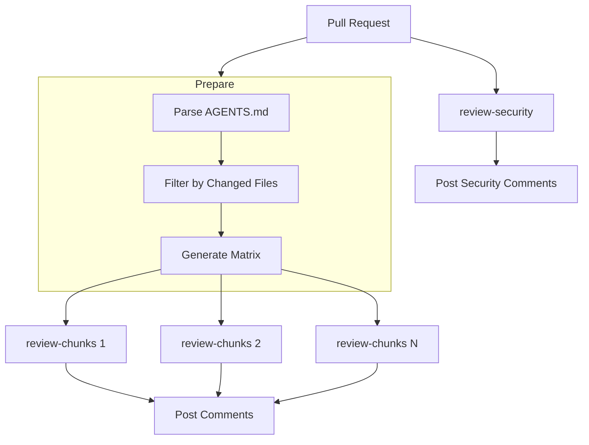

# GitHub Actions Integration

Automate code reviews on your pull requests with Open Reviewer.

## Overview

The Open Reviewer GitHub Actions workflow:

1. Triggers on pull requests
2. Parses AGENTS.md/CLAUDE.md for review guidelines
3. Reviews changed code in parallel
4. Posts inline comments on the PR
5. Runs security-specific analysis

## Prerequisites

- Completed [Multi-Model Consensus](multi-model-consensus.md) tutorial
- A GitHub repository
- API keys for OpenRouter and Anthropic

## Step 1: Add Secrets

Go to your repository's Settings > Secrets and variables > Actions.

Add these secrets:

| Secret | Description |
|--------|-------------|
| `ANTHROPIC_API_KEY` | Anthropic API key |
| `OPENROUTER_API_KEY` | OpenRouter API key |
| `QDRANT_API_KEY` | Qdrant API key (for semantic search) |

## Step 2: Copy the Workflow

Create `.github/workflows/review.yml`:

```yaml
name: Claude Code Review

on:
  pull_request:
    types: [opened, synchronize, reopened]
  issue_comment:
    types: [created]
  issues:
    types: [opened, labeled, assigned]

permissions:
  contents: read
  pull-requests: write
  issues: write

jobs:
  prepare-review:
    if: github.event_name == 'pull_request'
    runs-on: ubuntu-latest
    outputs:
      matrix: ${{ steps.generate-matrix.outputs.matrix }}
    steps:
      - uses: actions/checkout@v4
        with:
          fetch-depth: 0

      - name: Setup Python
        uses: actions/setup-python@v5
        with:
          python-version: '3.12'

      - name: Parse AGENTS.md files
        id: parse-agents
        run: |
          python .github/scripts/parse_agents_md.py > chunks.json

      - name: Filter chunks for changed files
        id: filter-chunks
        run: |
          python .github/scripts/filter_chunks.py \
            --chunks chunks.json \
            --base ${{ github.event.pull_request.base.sha }} \
            --head ${{ github.event.pull_request.head.sha }} \
            > filtered.json

      - name: Generate review matrix
        id: generate-matrix
        run: |
          echo "matrix=$(cat filtered.json | jq -c .)" >> $GITHUB_OUTPUT

  review-chunks:
    needs: prepare-review
    if: needs.prepare-review.outputs.matrix != '[]'
    runs-on: ubuntu-latest
    strategy:
      matrix:
        chunk: ${{ fromJson(needs.prepare-review.outputs.matrix) }}
      max-parallel: 10
    steps:
      - uses: actions/checkout@v4

      - name: Review chunk
        uses: ./.github/actions/claude-code-action
        with:
          anthropic_api_key: ${{ secrets.ANTHROPIC_API_KEY }}
          prompt: |
            Review the following code changes based on these guidelines:

            ${{ matrix.chunk.content }}

            Focus on:
            - Code quality issues
            - Potential bugs
            - Style violations

  review-security:
    if: github.event_name == 'pull_request'
    runs-on: ubuntu-latest
    steps:
      - uses: actions/checkout@v4

      - name: Security review
        uses: ./.github/actions/claude-code-action
        with:
          anthropic_api_key: ${{ secrets.ANTHROPIC_API_KEY }}
          prompt: |
            Review the changed files for security vulnerabilities.
            Check for OWASP Top 10 issues:
            - Injection (SQL, command, etc.)
            - Broken authentication
            - Sensitive data exposure
            - Security misconfiguration
```

## Step 3: Add Guidelines Files

### CLAUDE.md (Repository Root)

Create `CLAUDE.md` with repository-wide guidelines:

```markdown
# Repository Review Guidelines

## Code Style
- All functions must have type hints
- Maximum function length: 50 lines
- Use meaningful variable names

## Security
- Never log sensitive data
- Use parameterized queries
- Validate all user input

## Testing
- All new features need tests
- Minimum 80% code coverage
```

### AGENTS.md (Per Directory)

Create `backend/AGENTS.md` for backend-specific rules:

```markdown
# Backend Guidelines

## Database
- Use repository pattern
- No direct SQL in handlers
- Use transactions for multi-step operations

## API
- Validate request bodies with Pydantic
- Return proper HTTP status codes
- Document endpoints with OpenAPI
```

## Step 4: Test the Integration

1. Create a new branch
2. Make a code change
3. Open a pull request
4. Watch the Actions tab for the review workflow
5. Check the PR for inline comments

## Step 5: Add Semantic Search (Optional)

For enhanced reviews with similar code context:

1. Set up Qdrant Cloud at [qdrant.io](https://qdrant.io)

2. Index your repository:

```bash
cd review_eval
export OPENROUTER_API_KEY="..."
export QDRANT_URL="https://your-cluster.qdrant.io:6333"
export QDRANT_API_KEY="..."
uv run python -m review_eval.index_repo /path/to/repo --force
```

3. Add the `QDRANT_URL` secret to your repository

4. The workflow will automatically fetch similar code context

## Workflow Architecture



## Customizing Reviews

### Change the Trigger

Review only on specific file types:

```yaml
on:
  pull_request:
    paths:
      - '**.py'
      - '**.ts'
```

### Add More Review Jobs

```yaml
review-performance:
  runs-on: ubuntu-latest
  steps:
    - uses: ./.github/actions/claude-code-action
      with:
        prompt: |
          Review for performance issues:
          - N+1 queries
          - Unnecessary loops
          - Memory leaks
```

### Use @claude Mentions

Enable reviews on demand:

```yaml
handle-comment:
  if: |
    github.event_name == 'issue_comment' &&
    contains(github.event.comment.body, '@claude')
  steps:
    - uses: ./.github/actions/claude-code-action
```

Then comment `@claude review this` on any PR.

## Troubleshooting

### Reviews Not Appearing

1. Check the Actions tab for errors
2. Verify secrets are set correctly
3. Ensure the workflow has `pull-requests: write` permission

### Rate Limits

Add delays between reviews:

```yaml
strategy:
  max-parallel: 3  # Reduce parallel reviews
```

### Long Review Times

Use faster models for CI:

```yaml
with:
  model: "claude-3.5-haiku"  # Faster than Sonnet
```

## Next Steps

- [Set up semantic search](../how-to/setup-semantic-search.md)
- [Customize model configuration](../how-to/configure-models.md)
- [Understand the architecture](../explanation/architecture.md)
